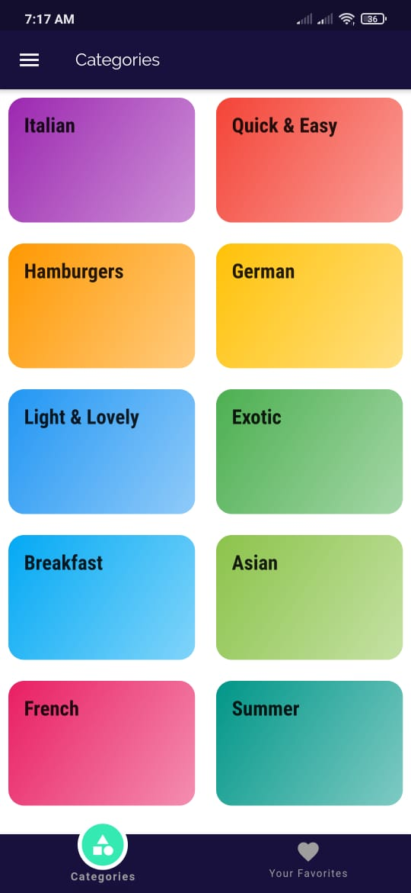
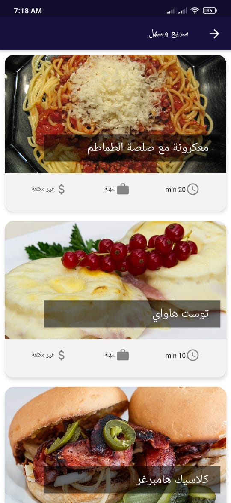
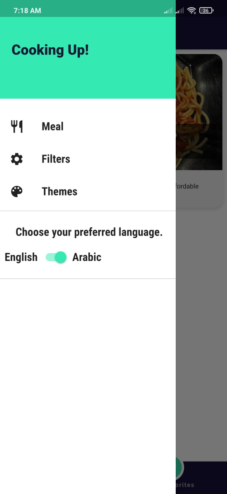
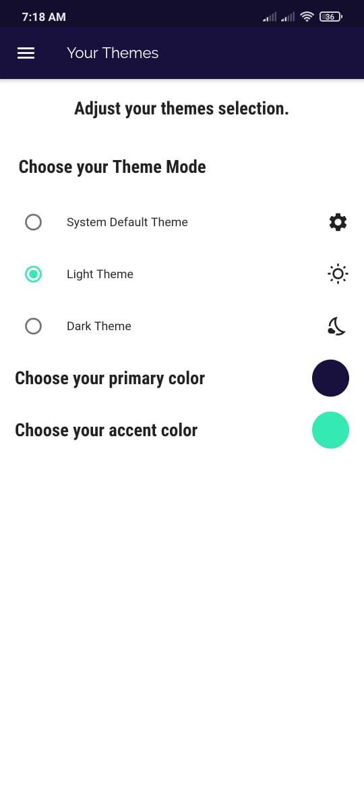
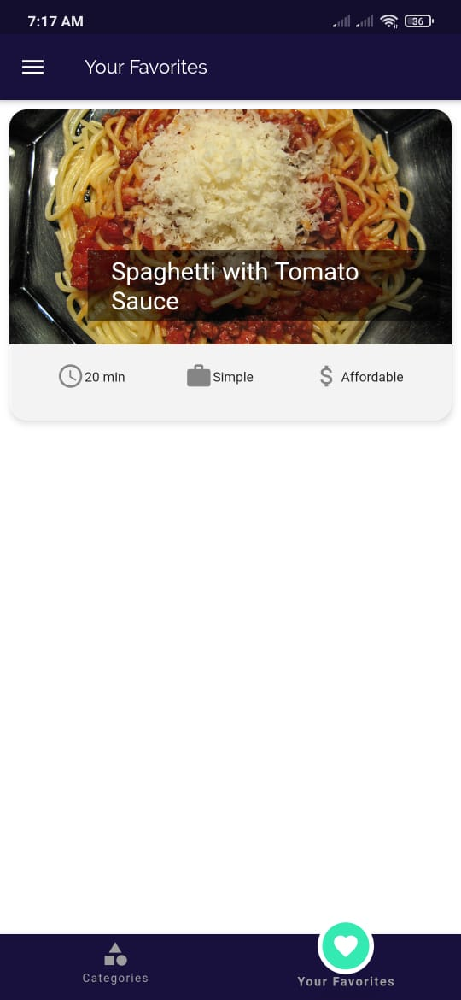
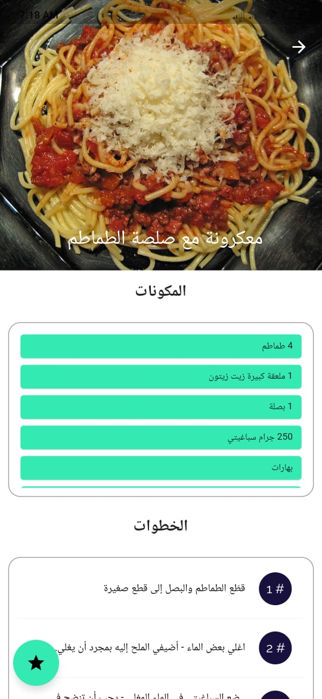
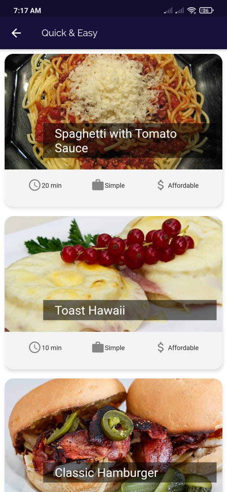
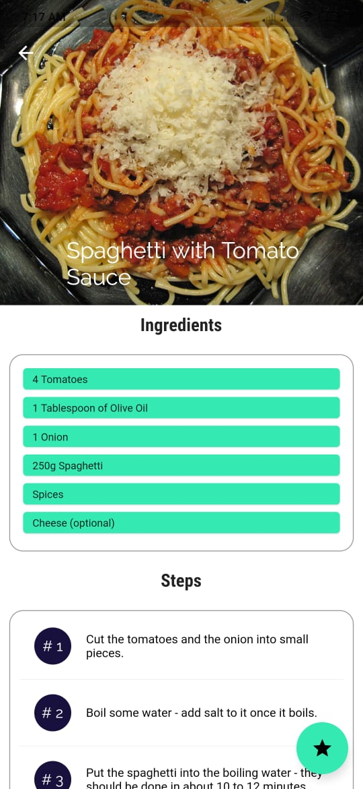
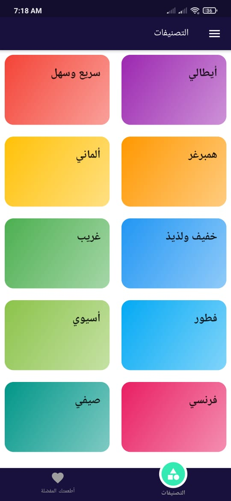
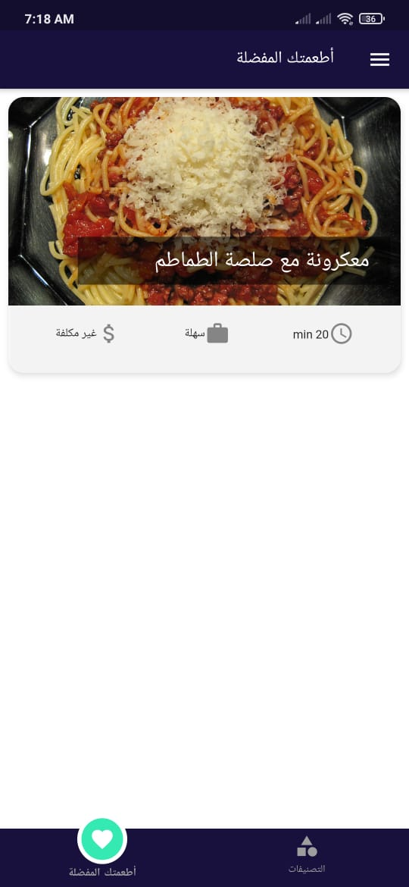

# my_meal

Restaurant Flutter application.
 *Screens => Category Screen - Meal Screen - Meal details Screen -Favorite Screen -Filter Screen -Theme Screen 
 *Support Arabic and English 
 *Support change app theme such appBar and others 
 *State Management (Provider) 
 *Local Data Storage
 
## Photos

